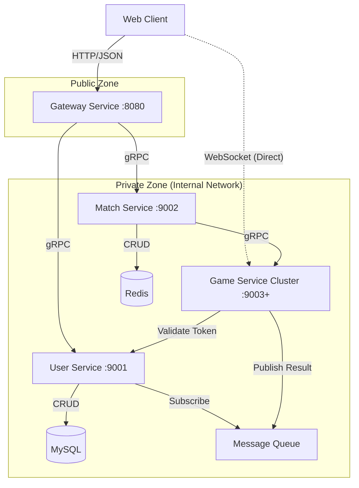

---

# 文档一：项目总体架构报告 (Project Overview)

**项目名称**：offgame (2D 在线竞技游戏)
**版本**：V1.0
**文档目标**：定义系统整体架构、技术栈标准及服务间交互流程。

## 1. 项目概述
本项目是一款基于 Web 的 2D 多人在线竞技游戏（大逃杀模式）。玩家通过网页端登录，在大厅创建/加入房间，进入游戏后通过 WASD 移动，蓄力释放光柱攻击其他玩家。游戏核心采用 **Golang** 开发高性能服务端，**React + Pixi.js** 开发客户端，旨在提供低延迟、高精度的竞技体验。

## 2. 技术栈标准 (Tech Stack)

### 服务端 (Golang)
*   **Web 框架**：Gin (用于 Gateway HTTP 接口及 WebSocket 握手升级)
*   **RPC 框架**：gRPC + Protobuf (微服务间通讯)
*   **ORM**：GORM (MySQL 数据操作)
*   **数据库**：MySQL 8.0 (持久化存储：用户、战绩)
*   **缓存/KV**：Redis 6+ (会话管理、房间列表、分布式锁)
*   **消息队列**：RabbitMQ (异步解耦战绩写入)

### 客户端 (Web)
*   **UI 框架**：React 18 + TypeScript (登录、大厅、HUD)
*   **游戏引擎**：Pixi.js (Canvas 2D 渲染)
*   **通讯协议**：
    *   **API**：Axios (HTTP JSON) -> Gateway
    *   **Game**：WebSocket (二进制 Protobuf) -> Game Service

## 3. 系统架构图



## 4. 核心工作流
1.  **登录/注册**：Client -> Gateway -> User Service (MySQL)。
2.  **创建房间**：Client -> Gateway -> Match Service (分配 Game Server IP) -> 返回 Client。
3.  **加入游戏**：Client -> 直接连接 Game Server IP (WebSocket) -> Game Loop。
4.  **游戏结算**：Game Server -> MQ -> User Service -> MySQL。

## 5. 游戏Tick系统架构 (Game Tick System)

### 5.1 基础参数
- **Tick Rate**: 64 Hz (每15.625ms一个tick)
- **延迟补偿**: 固定2 tick (31.25ms)
- **时间步长**: DeltaTime = 0.015625秒

### 5.2 延迟补偿机制
服务端采用**固定延迟补偿**策略确保竞技公平性：

1. **服务端权威**: 所有输入以服务端当前tick为准执行
2. **宽容窗口**: 接受2 tick内的延迟输入（覆盖网络波动）
3. **延迟执行**: 所有输入延迟2 tick后统一执行

```
客户端Tick 10: 发送移动输入(target_tick=12)
服务端Tick 12: 执行该输入（延迟2 tick）
```

### 5.3 公平性保证
- **高延迟玩家(200ms)**: 输入被缓存，延迟执行，公平参与
- **低延迟玩家(20ms)**: 输入提前到达，等待执行，体验流畅
- **作弊防护**: 拒绝超过2 tick的旧输入或来自未来的输入

### 5.4 技术实现
- 客户端发送输入时附带`target_tick`字段
- 服务端每个tick处理(target_tick == CurrentTick - DelayCompensation)的输入
- 使用`DeltaTime`进行物理计算，确保不同帧率下的一致性

---

